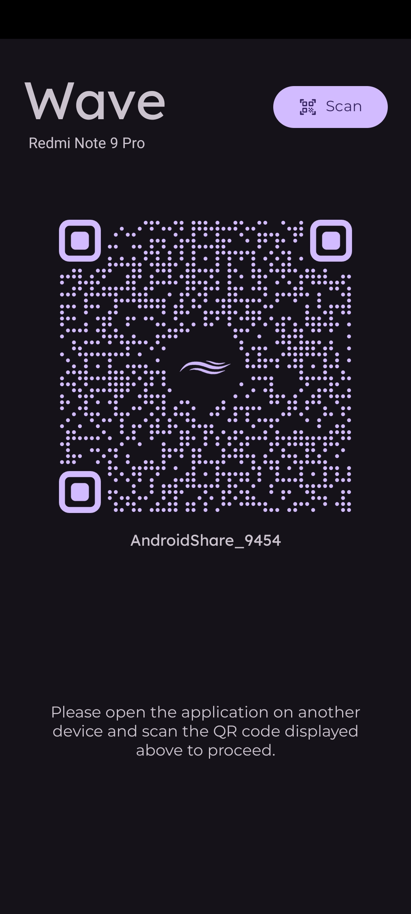
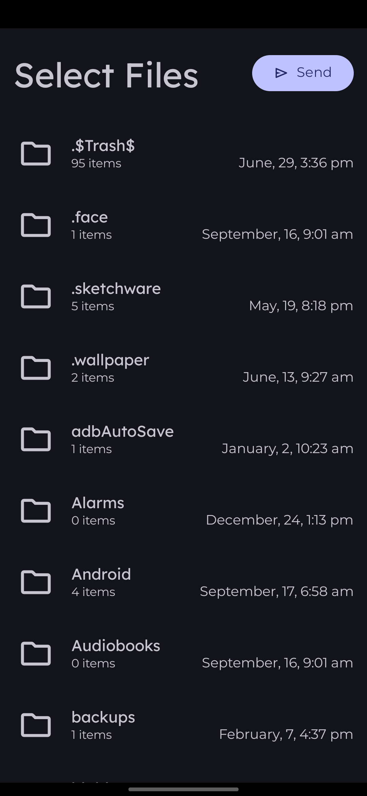
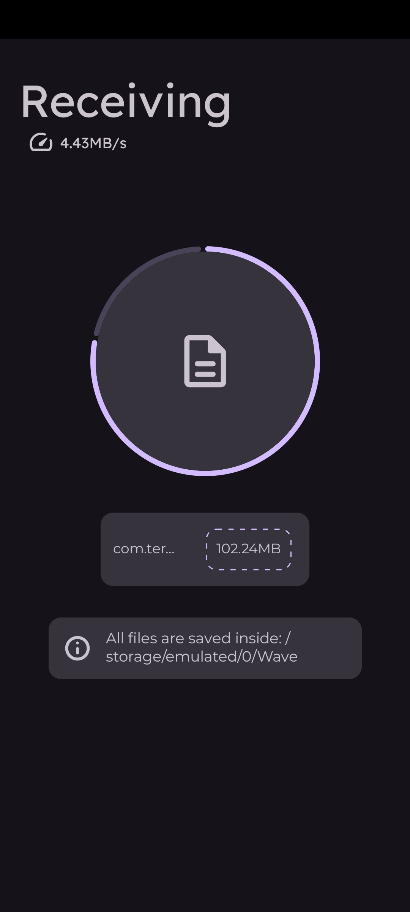

  

# 馃寠 Wave 鈥� Share Files Without Internet

**Wave** is a simple and fast Android app that lets you share files with nearby devices 鈥� no internet needed.  
It uses your phone鈥檚 built-in ability to create a **local-only Wi-Fi hotspot** and connects other devices through a QR code.  
Just open the app, scan, and share 鈥� it's that easy!

Wave is built with **Material 3**, giving it a clean, modern look that feels right at home on any Android device.

---

## 馃摳 Screenshots

> Add your screenshots in the `screenshots/` folder

| Connection Screen | File Selection | File Transfer |
|------------------|----------------|----------------|
|  |  |  |

---

## 馃摫 How to Use

1. Open **Wave** on both devices  
2. Each device creates a hotspot and waits for the other to scan  
3. On one device, tap **Scan QR** at the top right to scan the other device鈥檚 QR code  
4. After connecting:  
   - The **host** waits for the sender to start the transfer  
   - The **sender** selects files to send  
5. Tap **Send** at the top right to begin sharing  

  
That鈥檚 it 鈥� fast, easy, and completely offline.

---

## 鉂わ笍 Made Better With These Projects

Wave wouldn鈥檛 be possible without these amazing open-source libraries:

- 馃摲 [Custom QR Generator](https://github.com/alexzhirkevich/custom-qr-generator)  
  by **Alex Zhirkevich** 鈥� for generating beautiful and customizable QR codes.

- 馃洝锔� [Dexter](https://github.com/Karumi/Dexter)  
  by **Karumi** 鈥� for making runtime permission handling simple and reliable.

Big thanks to these awesome developers for making our job a whole lot easier!

---

## 馃 Got Ideas or Found a Bug?

We鈥檇 love to hear from you!  
Open an issue or send a pull request 鈥� all contributions are welcome.

For full contribution guidelines, check out our [CONTRIBUTING.md](CONTRIBUTING.md).

---

## 馃搫 License

Wave is open source and released under the **MIT License**.  
Check out the [LICENSE](LICENSE) file for details.

---

## 馃懆鈥嶐煉� Built By

**Deepak Singh**  
GitHub: [@VoxaCode](https://github.com/VoxaCode)